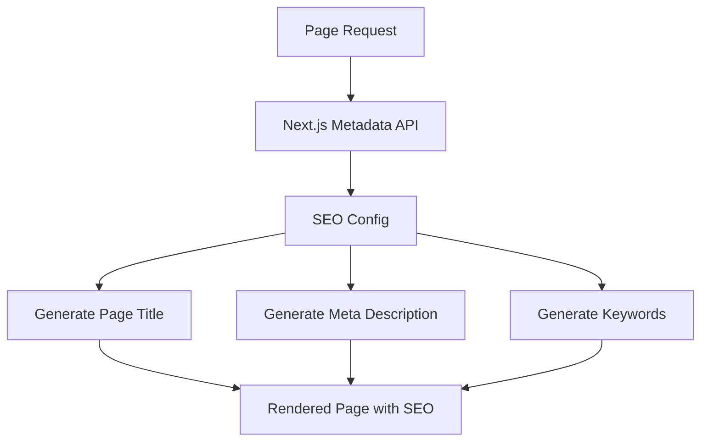

# SEO Tools Design Document

## Overview

This design outlines a streamlined SEO implementation for the travel website that will improve search engine visibility through proper page titles, meta descriptions, keywords, and basic social media tags. The focus is on updating existing pages with appropriate SEO metadata without complex content management features.

## Architecture

### Core Components

1. **SEO Configuration** - Centralized site information and default SEO values
2. **Page-Specific Metadata** - Individual page metadata using Next.js metadata API
3. **Global SEO Elements** - Site-wide SEO elements in the root layout

### System Flow



## Components and Interfaces

### 1. SEO Configuration

**Location:** `src/config/seo.ts`

```typescript
interface SiteConfig {
  name: string;
  description: string;
  url: string;
  keywords: string[];
  defaultImage: string;
}

const siteConfig: SiteConfig = {
  name: "SearchAway - Travel & Tour Booking",
  description: "Discover amazing destinations and book your perfect travel experience with SearchAway. Find tours, hotels, and travel packages worldwide.",
  url: "https://searchaway.com",
  keywords: ["travel", "tours", "booking", "destinations", "vacation", "hotels"],
  defaultImage: "/assets/img/logo/logo.png"
};
```

### 2. Page Metadata Implementation

**Individual Page Updates**
- Update each page's metadata export with proper titles
- Add descriptive meta descriptions for each page
- Include relevant keywords based on page content
- Add basic Open Graph tags for social sharing

**Title Structure**
- Format: `[Page Name] | SearchAway - Travel & Tour Booking`
- Keep titles under 60 characters for optimal display
- Make titles descriptive and unique for each page

### 3. Root Layout Enhancement

**Global SEO Elements**
- Update site-wide meta tags in layout.tsx
- Add proper viewport and charset declarations
- Include favicon and basic Open Graph tags
- Add site verification meta tags if needed

## Data Models

### Basic Page Metadata

```typescript
interface PageMetadata {
  title: string;
  description: string;
  keywords?: string;
  openGraph?: {
    title: string;
    description: string;
    images: string[];
  };
}
```

### Page-Specific SEO Content

**Homepage**
- Title: "SearchAway - Travel & Tour Booking | Discover Amazing Destinations"
- Description: "Book your perfect travel experience with SearchAway. Find tours, hotels, and vacation packages to amazing destinations worldwide."

**Tour Pages**
- Title: "[Tour Name] | SearchAway Tours"
- Description: "Book [Tour Name] with SearchAway. [Duration] tour in [Location] starting from $[Price]. Discover amazing experiences and create unforgettable memories."

**Static Pages**
- About: "About SearchAway | Your Trusted Travel Partner"
- Contact: "Contact SearchAway | Get in Touch for Travel Support"
- Blog: "Travel Blog | SearchAway Travel Tips & Guides"

## Error Handling

### Fallback Mechanisms

1. **Missing Data Handling**
   - Default site title and description if page-specific data is missing
   - Fallback to site name for incomplete titles
   - Default keywords from site configuration

2. **Content Validation**
   - Ensure meta descriptions stay under 160 characters
   - Validate title lengths for optimal search display
   - Basic HTML entity encoding for special characters

## Testing Strategy

### Manual Testing

1. **Page Title Verification**
   - Check that all pages have unique, descriptive titles
   - Verify title format consistency across pages
   - Ensure titles display properly in browser tabs

2. **Meta Description Testing**
   - Confirm descriptions are under 160 characters
   - Verify descriptions are unique and descriptive
   - Test how descriptions appear in search results

3. **Social Media Preview Testing**
   - Test Open Graph tags with Facebook debugger
   - Verify social sharing displays correct information
   - Check default images appear when sharing

### Validation Tools

1. **SEO Validation**
   - Use Google Search Console to validate metadata
   - Check for duplicate titles or descriptions
   - Monitor search appearance in Google results

2. **Technical Validation**
   - Validate HTML markup with W3C validator
   - Check meta tag implementation in browser dev tools
   - Verify favicon and basic elements load correctly

## Implementation Approach

### Simple Implementation Strategy

1. **Create SEO Configuration**
   - Set up basic site configuration with name, description, and keywords
   - Define default values for fallback scenarios

2. **Update Root Layout**
   - Enhance global meta tags in layout.tsx
   - Add proper site-wide SEO elements
   - Update favicon and basic Open Graph tags

3. **Update Individual Pages**
   - Add proper metadata exports to each page
   - Create unique titles and descriptions
   - Include relevant keywords for each page type

4. **Add Basic Social Media Support**
   - Include Open Graph meta tags for social sharing
   - Add Twitter Card support for better social previews
   - Use default site image for pages without specific images

## Technical Considerations

### SEO Best Practices

1. **Title Optimization**
   - Keep titles under 60 characters
   - Include site name consistently
   - Make each title unique and descriptive

2. **Meta Description Guidelines**
   - Keep descriptions between 150-160 characters
   - Write compelling, action-oriented descriptions
   - Include relevant keywords naturally

3. **Keyword Strategy**
   - Use relevant travel and tourism keywords
   - Include location-based keywords for tour pages
   - Avoid keyword stuffing

### Next.js Integration

1. **Metadata API Usage**
   - Use Next.js 13+ metadata API for optimal SEO
   - Implement static metadata for most pages
   - Consider dynamic metadata for tour detail pages

2. **Performance Considerations**
   - Minimal impact on page load times
   - Use static metadata where possible
   - Optimize images used in social sharing